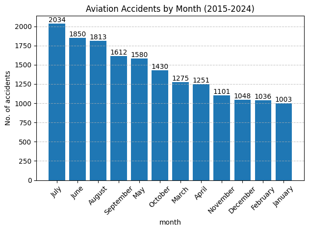
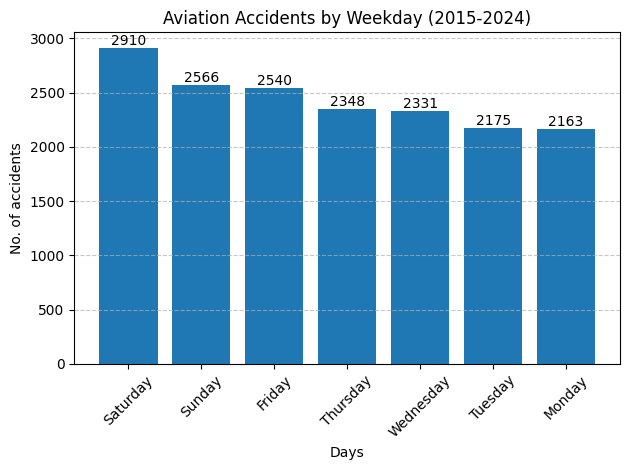

# Aviation Accident Analysis (NTSB, 2014–2024)
### Overview
This project analyzes aviation accident and incident data published by the National Transportation Safety Board (NTSB) for the period 2014–2024.
The objective is to explore historical trends and patterns using Python and pandas.

The dataset used in the analysis is static and represents a one-time extraction of historical data. The focus of this repository is data understanding and analysis, not live data ingestion.

---
### Data Source

* Source: National Transportation Safety Board (NTSB)
* Access Method: Official NTSB public API
* Data Type: Aviation accident and incident records
* Coverage: 2014–2024
* Status: Public, non-sensitive historical data
* The NTSB API returns structured JSON responses. These responses were collected once and converted into a CSV file used throughout the analysis.
---
### Repository Structure
.
├── ntsb_data_collection.ipynb        # One-time data extraction from NTSB API
├── ntsb_analysis.ipynb               # Data cleaning and analysis
├── ntsb_raw_data.csv                 # Static dataset (2014–2024)
├── data.json                         # Example API response schema
├── requirements.txt                  # Libraries used in the project
├── weekday_insight.png               # image of weekday insight graph
├── month_insight.png                 # image of months insight graph
└── README.md                         # Project documentation

---
### Data Collection Methodology

* Accident data was requested from the NTSB public API using HTTP GET requests.
* The API returns paginated JSON responses.
* Relevant fields were extracted and normalized into tabular form.
* The normalized data was saved as a CSV file (ntsb_raw_data.csv).
* The CSV is treated as immutable for the purposes of this project.
* The included sample JSON file reflects the structure of the API responses at the time of data collection.

---
### Key Findings
1. Seasonal Variation in Aviation Accidents

* Analysis of accident counts by month (2015–2024) shows a clear seasonal pattern:
* Accident counts peak during the summer months, with July having the highest number of recorded accidents.
* June and August also show elevated accident frequencies.
* The lowest accident counts occur during the winter months, particularly January and February.
* This pattern likely reflects increased flight activity during summer, especially in general aviation, recreational flying, and training operations, rather than seasonal changes in aircraft safety or weather alone.
  

1. Distribution of Accidents by Day of the Week

* Accident counts also vary by day of the week:
* Saturday has the highest number of recorded accidents.
* Sunday and Friday follow closely behind.
* Monday and Tuesday show the lowest accident frequencies.
* This distribution is consistent with higher weekend flight activity, particularly for non-commercial and leisure operations, which are more prevalent outside standard weekday schedules.
  

---
### Interpretation Notes

* These findings represent absolute accident counts, not accident rates.
* The analysis does not account for exposure (e.g., number of flights, flight hours, or pilot demographics).
* Higher counts should be interpreted as reflecting activity volume, not necessarily increased risk per flight.
* No causal conclusions are drawn from this exploratory analysis.